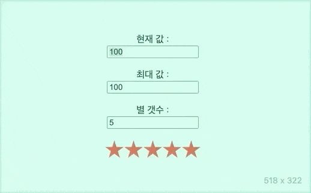

# 별점 컴포넌트

## 사용법

```tsx
<StarRating
  now={45} // 현재값
  max={100} // 최대값
  maximumStars={10} // 별의 최대 갯수, Optional, 기본값 5
  sStarColor='red' // 별 색깔, Optional, 기본값 red
  sBackgroundColor='#ddd' // 별의 배경색, Optional, 기본값 #ddd
/>
```

## 영상



## 의존성

- react
- typescript
- styled-components

## 데모

- [http://stars_bityoungjae.surge.sh](http://stars_bityoungjae.surge.sh)
  - 마우스와 터치로 슬라이드 조작이 가능하도록 수정하였습니다.
